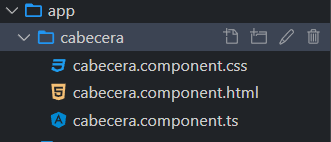

[Regresar](/DAWM-2022/)

Angular - Bases
====================


Es un framework, en JavaScript, para crear aplicaciones web con html, css y typescript. Incorpora la combinación de plantillas, la inyección de dependencias, programación reactiva, directivas y más; mediante la aplicación buenas prácticas de programación. Las aplicaciones desarrolladas con Angular para la web, móvil o para escritorio.

Introducción
============

* * *

En el proyecto Angular tiene la siguiente estructura de archivos con su descripción:

*   **angular.json** con la descripción del proyecto
*   **package.json** con los paquetes instalados
*   **styles.css** estilo global de la app
*   **index.html** página de inicio
*   **src/app** para componentes y servicios
*   **src/assets** para los archivos estáticos como imágenes
*   **app.module.ts** punto inicial de la aplicación
*   **Componentes**: ts, .html y .css; o todo embebido en un .ts  
    

Componentes
===========

* * *

Los componentes son los componentes básicos de una interfaz de usuario en una aplicación Angular. Estos componentes están asociados con una plantilla y son un subconjunto de directivas.


* Para crear un componente:

    + Desde la línea de comandos, en la ruta raíz del proyecto de Angular:
      ```
      ng g c <nombre del componente>
      ```
    + Se creará una carpeta con el nombre del componente, con los componentes: **.html**, **.css** y **.ts** (luego, Angular se encargará de convertir a **.js**).
    
    
    
    + El mensaje de `update` indica que el componente creado está incluido en el arreglo de declaraciones del componente principal (`src/app.module.ts`).

* Para modificar (la vista) un componente:

    + Agregue/modifique las etiquetas html, en el archivo **.html** del componente.
    + Agregue/modifique el estilo de las etiquetas html con los selectores y propiedades css, en el archivo **.css** del componente.
    + Actualice el navegador o (re)inicie el servidor

* Para usar (renderizar) un componente:
    
    + Identifique el selector del componente hijo en el decorador de la clase:
      ```
      @Component({
          selector: 'app-cabecera',
          templateUrl: './cabecera.component.html',
          styleUrls: ['./cabecera.component.css']
      })
      ```
    + Use el selector en el **.html** de cualquier otro componente
      ```
      <app-cabecera></app-cabecera>
      ``` 

    + Actualice el navegador o (re)inicie el servidor


Comunicación de una via (one-way binding) 
=========================================

* * *

* En el **.ts** del componente

  + Agregue el atributo `mensaje` dentro de la clase

    ```
    mensaje:string = "Este es un mensaje"
    ```
* En el **.html** del componente
  
  + Agregue las etiquetas necesarias y coloque como texto el atributo `mensaje`
  
    ```
    <div>{{mensaje}}</div>
    ```   
* Actualice el navegador o (re)inicie el servidor
    

Directivas
==========

* * *

Utilice la aplicación [Angular 003](https://stackblitz.com/edit/angular-tot3) complete el componente pizarra.

*   Revisar el componente**keywords**
*   Crear el componente**pizarra**
    *   En **pizarra.component.ts**: Agregrar el atributo **terminos**
```
terminos:any[] = [
    {
    "palabra":"fork",
    "significado":"Copia de un proyecto en una dirección distinta en el repositorio",
    "enlace":"https://es.wikipedia.org/wiki/Bifurcación\_(desarrollo\_de\_software)",
    "autor":"Autor 1"
    },
    {
    "palabra":"saas",
    "significado":"'Software as a Service', mediante un navegador web se accede a un software el cual se enceuntra alojado en servidores del proveedor",
    "enlace":" http://www.portalsaas.com/que-es-saas-software-as-a-service.php",
    "autor":"Autor 2"
    },
    {
      "palabra":"stateless",
      "significado":"Un stateless system puede ser visto como una caja negra, donde en cualquier momento, el valor de la salida depende solo del valor de la entrada después de un cierto tiempo de procesamiento. Mientras que un stateful system puede verse como una caja donde, en cualquier momento, el valor de la salida depende del valor de la entrada y de un estado interno, por lo que básicamente un stateful system es como una máquina de estados 'con memoria'. Es decir, el mismo conjunto de valores de entrada puede generar salidas diferentes dependiendo de la entrada anterior recibida por el sistema.",
      "enlace":"https://nordicapis.com/defining-stateful-vs-stateless-web-services/",
      "autor":"Autor 1"
    },
    {
      "palabra":"encoding",
      "significado":"Es el proceso por el cual la información de una fuente es convertida en símbolos para ser comunicada.",
      "enlace":"http://www.alegsa.com.ar/Dic/encoding.php",
      "autor":"Autor 3"
    }
  ]

```

*   *   En **pizarra.component.html**:
        
        <div class="card-columns">
          <!-- Agregar el \*ngFor -->
          <div class="card"   >
            <div class="card-body">
               <!-- Enlace -->
               <a href="#" class="card-link"  href="    " target="\_blank">
                <h5 class="card-title">
                  <!-- Palabra -->
        
                </h5>
              </a>
              <p class="card-text">    
                <!-- Significado -->
        
              </p>
              <h6 class="card-subtitle mb-2 text-muted text-right">  
                <!-- Autor -->
        
              </h6>
            </div>
          </div>
        </div>  
        


Referencias 
===========

* * *

* Angular. (2021). Retrieved 1 December 2021, from [https://angular.io/](https://angular.io/)
* Introduction to Angular Components and How to Implement It? (20202) https://www.simplilearn.com/tutorials/angular-tutorial/angular-components
* Guía de iniciación al data binding en Angular Qué es y cómo se utiliza. (2019). Retrieved 13 July 2022, from https://www.acontracorrientech.com/guia-practica-del-databinding-en-angular/
* Angular. (2021). Retrieved 1 December 2021, from [https://angular.io/tutorial](https://angular.io/tutorial)
* 19 Things You Need to Learn to Become an Effective Angular Developer. (2021). Retrieved 1 December 2021, from https://www.dottedsquirrel.com/things-to-learn-angular/